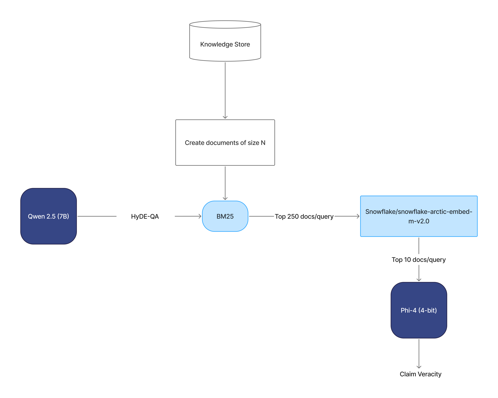

# 🧠 Fathom: A Fast and Modular RAG Pipeline for Automated Fact-Checking

Fathom is an efficient, fully open-source pipeline for automated fact-checking of real-world claims, designed for the AVeriTeC 2025 shared task. It combines HyDE-style query expansion, hybrid evidence retrieval, and lightweight LLM-based veracity classification — all under 30 seconds per claim.



## 🚀 Key Features

- **Open Source LLMs Only** – Efficient end-to-end pipeline using Qwen2.5-7B, Snowflake Arctic-Embed, and Phi-4 GPTQ.
- **HyDE-Style QA Generation** – Expands each claim into multiple QA pairs to improve retrieval precision.
- **Hybrid Retrieval** – Combines BM25 sparse retrieval with semantic reranking for high-recall, high-precision evidence collection.
- **Fast Veracity Classification** – Uses a quantized 4-bit Phi-4 model with chain-of-thought reasoning to produce labels and rationales.
- **Time Efficient** – Achieves high AVeriTeC scores with low latency (22s/claim on test set).

## 📊 Performance

| Split | AVeriTeC Score | Q+A (Ev2R) Recall | Runtime/claim |
|-------|----------------|-------------------|----------------|
| Dev   | **0.378**      | 0.5137            | 20s           |
| Test  | **0.2043**     | 0.3368            | 22.73s        |

> CheckMate ranks **6th overall** on the AVeriTeC 2025 leaderboard using only open-source models.

## 🧱 Pipeline Components

1. **HyDE QA Generation**  
   - Model: `Qwen2.5-7B-Instruct`  
   - Generates detailed QA pairs for claim decomposition.

2. **Sparse Retrieval**  
   - Method: BM25 over claim-specific knowledge store.  
   - Top-250 chunks per QA query, deduplicated.

3. **Semantic Reranking**  
   - Model: `Snowflake/snowflake-arctic-embed-m-v2.0`  
   - Re-ranks chunks using cosine similarity.

4. **Veracity Classification**  
   - Model: `jakiAJK/microsoft-phi-4_GPTQ-int4` (4-bit)  
   - Chain-of-Thought reasoning, outputs label and justification.

## 🖥️ Hardware

- Development: NVIDIA Quadro RTX 8000 (48 GB)
- Final testing: NVIDIA A10G GPU (AVeriTeC Evaluation VM)
- BM25 is parallelized across CPU cores and threads for retrieval efficiency.
- Semantic reranking runs with embedding batch size of 128.
- Phi-4 GPTQ inference runs in batches of 4 for optimal latency.

## 📁 Project Structure
```
├── main/
│   ├── question_gen_hyde.py       # HyDE-style QA generation
│   ├── retrieve_bm25.py           # Sparse retrieval using BM25
│   ├── semantic_retrieval.py      # Semantic reranking of retrieved chunks
│   ├── veracity_pred.py           # Veracity classification with CoT
├── images/
│   └── arch_diagram.png           # System architecture diagram
├── data/
│   └── [claims, predictions, scores, knowledge_store]
├── config.env                     # Environment and model configuration
├── run_system.sh                  # Shell script to run the full pipeline
└── README.md                      # Project documentation
```